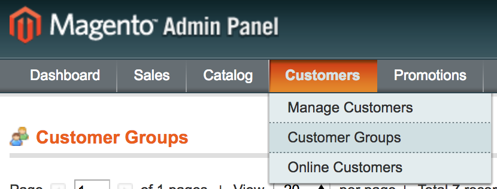
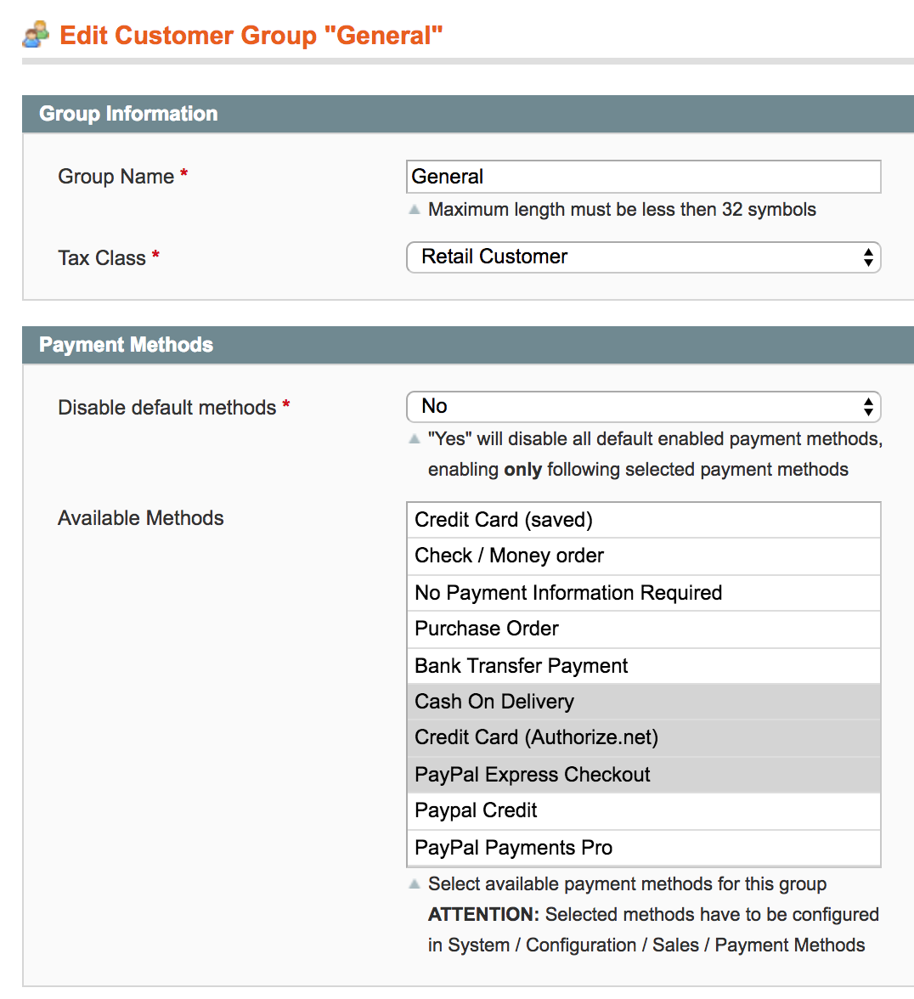

# E-CONOMIX: Customergroup Paymentmethods
The E-CONOMIX "Customergroup Paymentmethods" extension provides the possibility to enable payment methods only for specific customer groups.

## Installation
The module can be installed via composer:

`composer require e-conomix/customergroup-paymentmethod`

## Configuration
After successful installation open your Magento Admin area and go to *Customers* => *Customer Groups*.

Open the group you like to enable additional payment methods for.   
Here you find a new panel *Payment Methods* to configure the payment methods for the customer group:

* **Disable default methods:** If set to *Yes*, this disables all payment methods that are enabled in the system configuration and only leaves following configured methods available.
* **Available Methods:** Defines the methods that should be available for the customer group.
   * If *Disable default methods* is set to *Yes* **only** this methods are available, otherwise the selected methods are additionaly available to the methods enabled in the system configuration
   * **IMPORTANT:** All methods that are selected here **must** be configured in the system configuration, but it has to be **disabled** in system configuration if it should only be available for specific customer groups.

## Developer
Andreas Schrammel - E-CONOMIX GmbH &copy; 2017